# My Pokemon Database

## Entity Relationship Diagram

The ERD below shows the relationships between the different tables.

```mermaid
erDiagram

    GENERATION {
        int generation_id PK
        int generation_number
        string generation_name
    }

    REGION {
        int region_id PK
        string region_name
    }

    GAME {
        int game_id PK
        string game_name
        int generation_id FK
        int region_id FK
    }

    POKEMON_SPECIES {
        int species_id PK
        int national_number UK
        string species_name
        int generation_introduced_id FK
    }

    POKEMON_FORM {
        int form_id PK
        int species_id FK
        string form_name
        boolean is_default_form
        decimal height
        decimal weight
    }

    POKEMON_TYPE {
        int type_id PK
        string type_name
    }

    POKEMON_FORM_TYPE {
        int form_id PK, FK
        int type_id FK
        int generation_id PK, FK
        int type_slot PK
    }

    STAT {
        int stat_id PK
        string stat_name
    }

    POKEMON_FORM_BASE_STAT {
        int form_id PK, FK
        int stat_id PK, FK
        int generation_id PK, FK
        int base_stat
    }

    NATURE {
        int nature_id PK
        string nature_name
        int increased_stat_id FK
        int decreased_stat_id FK
    }

    ABILITY {
        int ability_id PK
        string ability_name
        string ability_description
        int generation_introduced_id FK
    }

    POKEMON_FORM_ABILITY {
        int form_id PK, FK
        int ability_id FK
        int generation_id PK, FK
        int ability_slot PK
        boolean is_hidden
    }

    MOVE {
        int move_id PK
        string move_name
        int generation_introduced_id FK
    }

    MOVE_GAME_DATA {
        int move_id PK, FK
        int generation_id PK, FK
        int type_id FK
        string category
        int power
        int accuracy
        int pp
        string effect_description
        int effect_probability
    }

    POKEMON_FORM_MOVE {
        int form_id PK, FK
        int move_id PK, FK
        int game_id PK, FK
        string learn_method PK
        int learn_level
        string machine_number
    }

    POKEDEX {
        int pokedex_id PK
        string pokedex_name
        int region_id FK
        int game_id FK
        boolean is_national
    }

    POKEDEX_ENTRY {
        int pokedex_id PK, FK
        int species_id PK, FK
        int dex_number
    }

    TYPE_EFFECTIVENESS {
        int attacking_type_id PK, FK
        int defending_type_id PK, FK
        int generation_id PK, FK
        decimal multiplier
    }


    GENERATION ||--o{ GAME : has
    REGION ||--o{ GAME : contains

    GENERATION ||--o{ POKEMON_SPECIES : introduces
    POKEMON_SPECIES ||--o{ POKEMON_FORM : has

    POKEMON_FORM ||--o{ POKEMON_FORM_TYPE : has
    POKEMON_TYPE ||--o{ POKEMON_FORM_TYPE : assigned_as
    GENERATION ||--o{ POKEMON_FORM_TYPE : valid_in

    POKEMON_FORM ||--o{ POKEMON_FORM_BASE_STAT : has
    STAT ||--o{ POKEMON_FORM_BASE_STAT : measured_by
    GENERATION ||--o{ POKEMON_FORM_BASE_STAT : valid_in

    STAT ||--o{ NATURE : increases
    STAT ||--o{ NATURE : decreases

    GENERATION ||--o{ ABILITY : introduces
    POKEMON_FORM ||--o{ POKEMON_FORM_ABILITY : has
    ABILITY ||--o{ POKEMON_FORM_ABILITY : assigned_as
    GENERATION ||--o{ POKEMON_FORM_ABILITY : valid_in

    GENERATION ||--o{ MOVE : introduces
    MOVE ||--o{ MOVE_GAME_DATA : has
    GENERATION ||--o{ MOVE_GAME_DATA : valid_in
    POKEMON_TYPE ||--o{ MOVE_GAME_DATA : gives_type

    POKEMON_FORM ||--o{ POKEMON_FORM_MOVE : learns
    MOVE ||--o{ POKEMON_FORM_MOVE : learned_as
    GAME ||--o{ POKEMON_FORM_MOVE : available_in

    REGION ||--o{ POKEDEX : has
    GAME ||--o{ POKEDEX : uses
    POKEDEX ||--o{ POKEDEX_ENTRY : contains
    POKEMON_SPECIES ||--o{ POKEDEX_ENTRY : listed_as

    POKEMON_TYPE ||--o{ TYPE_EFFECTIVENESS : attacks
    POKEMON_TYPE ||--o{ TYPE_EFFECTIVENESS : defends
    GENERATION ||--o{ TYPE_EFFECTIVENESS : valid_in
```

## Legal Disclaimer
This project is an open-source educational portfolio piece. The code is licensed under the MIT License. 

However, all Pokémon data, images, names, and related media are trademarks and copyrights of Nintendo, Game Freak, or The Pokémon Company. No copyright infringement is intended. This project is entirely non-commercial.
